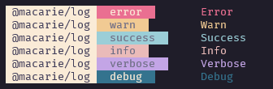

# 🍕 [@macarie/log](https://github.com/macarie/log) [](https://www.npmjs.com/package/@macarie/log)

> A dead-simple logger


The main reason for the existence of this module is to be used by me, and it will:

- stay dead-simple;
- follow **my** tastes, _and these may change with time_.

## Install

```console
$ npm install @macarie/log
```

Or if you prefer using Yarn:

```console
$ yarn add @macarie/log
```

## Usage

```javascript
import { createLogger, LOG_LEVEL } from "@macarie/log"

const log = createLogger("@macarie/log", LOG_LEVEL.DEBUG)

log("error", "Error")
log("warn", "Warn")
log("success", "Success")
log("info", "Info")
log("verbose", "Verbose")
log("debug", "Debug")
```



## API

### createLogger(moduleName, initialLogLevel?, formatModuleName?)

Returns: [`logger`](#loggerloglevel-message)

Creates and returns a [_scoped_ `logger`](#loggerloglevel-message): this means that it's possible to set its log level independently.

It's possible to change the styles of the tag that appears before the log. To do that, pass a function as the third parameter: it receives the `moduleName` as an input and should output the desired styled tag.

#### `moduleName`

Type: `string`<br>
Required: `true`

The scope of the logger, it's printed in front of its logs.

#### `initailLogLevel`

Type: [`LOG_LEVEL`](#log_level)<br>
Required: `false`<br>
Default: [`LOG_LEVEL.INFO`](#log_level)

The initial log level used while logging.

#### `formatModuleName`

Type: `(moduleName: string) => string`<br>
Required: `false`

The function mentioned above. It formats the logger's tag.

### logger(logLevel, message)

Log a message using the styles associated with `logLevel`.

The logs show up only if the level of `logLevel` is less or equal to the logger's [`LOG_LEVEL`](#log_level).

#### `logLevel`

Type: `'error' | 'warn' | 'success' | 'info' | 'verbose' | 'debug'`<br>
Required: `true`

The message's log level.

#### `message`

Type: `string`<br>
Required: `true`

The message to log.

### logger.setLogLevel(level)

Set the logger's log level.

#### `level`

Type: [`LOG_LEVEL`](#log_level)<br>
Required: `true`

The new log level to use.

### logger.getLogLevel()

Returns: [`LOG_LEVEL`](#log_level)

Get the logger's log level.

### LOG_LEVEL

A numeric [`enum`](https://www.typescriptlang.org/docs/handbook/enums.html) with the following members:

| Member    | Logs                                                                    |
| --------- | ----------------------------------------------------------------------- |
| `OFF`     | Nothing.                                                                |
| `ERROR`   | `'error'`.                                                              |
| `WARN`    | `'error'` and `'warn'`.                                                 |
| `SUCCESS` | `'error'`, `'warn'`, and `'success'`.                                   |
| `INFO`    | `'error'`, `'warn'`, `'success'`, and `'info'`.                         |
| `VERBOSE` | `'error'`, `'warn'`, `'success'`, `'info'`, and `'verbose'`.            |
| `DEBUG`   | `'error'`, `'warn'`, `'success'`, `'info'`, `'verbose'`, and `'debug'`. |

### log(logLevel, message)

A [`logger`](#loggerloglevel-message) with no _scope_ applied. You should use this one as a global logger.

## More Examples

Using the global logger:

```javascript
// Log's default log level is `LOG_LEVEL.INFO`.
import { log } from "@macarie/log"

// This will be logged
log("info", "Info")

// This won't be logged
log("verbose", "Verbose")
```

Setting the global logger's log level:

```javascript
import { log, LOG_LEVEL } from "@macarie/log"

log.setLogLevel(LOG_LEVEL.VERBOSE)

// This will be logged
log("info", "Info")

// Now this will also be logged
log("verbose", "Verbose")
```

## License

MIT © [Raul Macarie](https://macarie.me).
